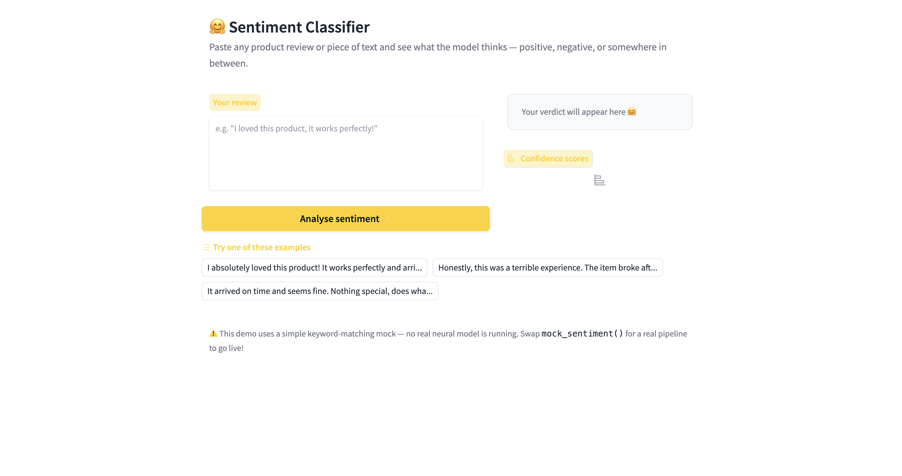
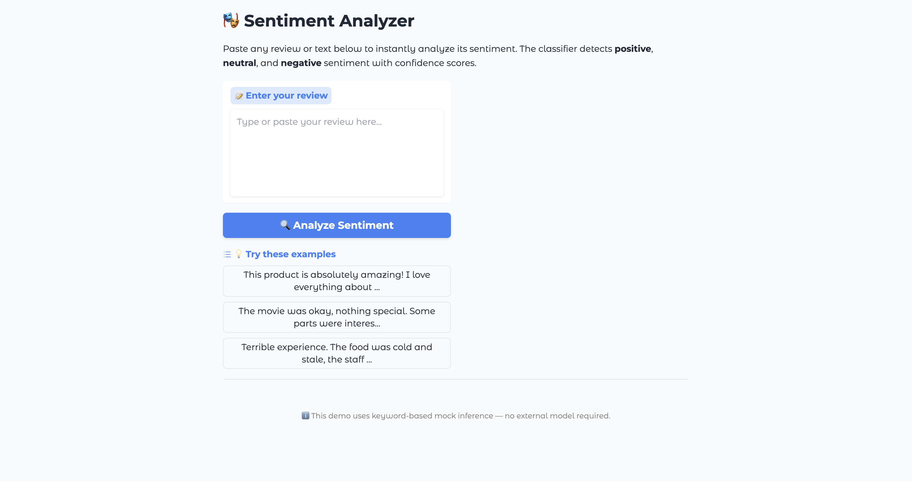
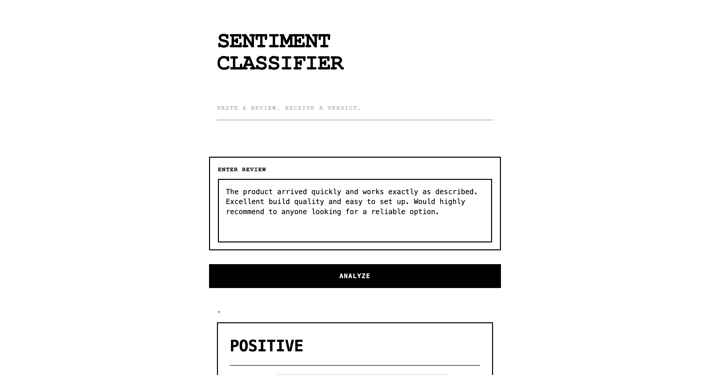

# Hands-on: Build the Space

You fine-tuned a model in Unit 1. Time to give it a demo people can actually click on.

## The Setup

Clone the starter and install the brand skill:

```bash
git clone https://github.com/huggingface/skills-course-unit2-starter
cd skills-course-unit2-starter
cp -r skills/hf-brand .claude/skills/
```

> [!NOTE]
> If you didn't complete the Unit 1 fine-tune (it requires HF Pro), that's fine — the scaffold has a mock `predict()` function. You can swap in your real model later, or use any Hub model.

## What the Brand Skill Does

Open `.claude/skills/hf-brand/SKILL.md`. It's about 60 lines encoding Hugging Face's visual identity:

- Primary yellow `#FFD21E`, orange `#FF9D00` hover
- The 🤗 emoji as the brand mark
- Source Sans Pro font, soft rounded corners
- Warm, welcoming copy — "Try it out!" not "ENTER TEXT"
- The Gradio 6 theme config, pre-written

It's a **brand guideline in skill form**. Claude reads it and builds accordingly.

## Build It

Open Claude Code in the starter directory:

```bash
claude
```

Ask:

```
Build a Gradio demo for the sentiment classifier in app_scaffold.py.
Keep the mock predict() function — just build a proper UI around it.
Three example inputs. Make it ready to deploy as a Space.
```

You didn't say "use the HF brand skill." Claude matched the request ("Gradio", "Space") to the skill's description and loaded it.

## What You'll See

With the skill loaded, the app Claude builds looks like this:



🤗 in the title. Yellow button with dark text. Soft rounded cards. Copy like *"Paste any review and see what the model thinks."*

<details>
<summary>What it looks like without the skill</summary>

Same prompt, same model, no brand skill:



It works. It's fine. It also looks like every other Gradio app on the Hub — generic blue, random emoji, default theme.

</details>

## Run It

```bash
pip install gradio
python app.py
```

Open `http://localhost:7860`. Click around.

## Try a Different Aesthetic

The starter also includes `skills/brutalist/` — monochrome, monospace, hard edges, ALL CAPS labels. Swap it in:

```bash
rm -r .claude/skills/hf-brand
cp -r skills/brutalist .claude/skills/
```

`/reload-plugins` in Claude Code, then ask for a rebuild. Same app, different personality:



`SENTIMENT CLASSIFIER` in heavy black caps. `PASTE A REVIEW. RECEIVE A VERDICT.` Zero rounded corners.

Same 60-odd lines of skill. Completely different output.

Next: what to do when it's *almost* right.
